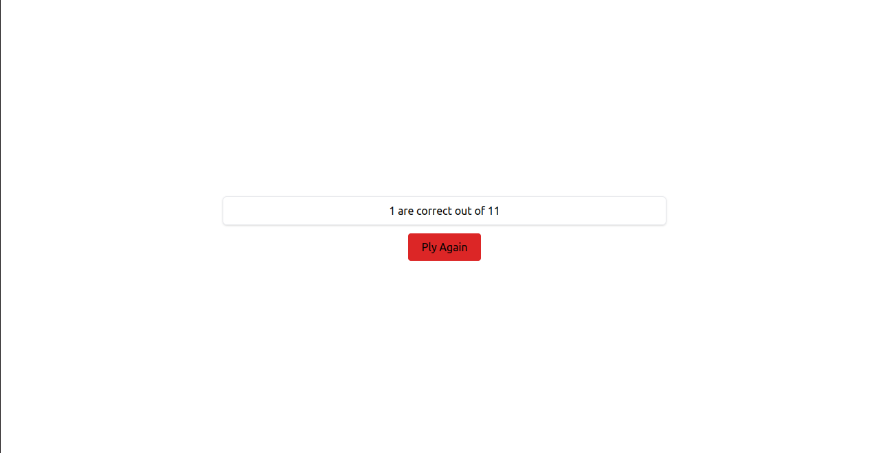

This is a simple react quiz application with globally state managed with context.

After entering to app you will get the first page with a start button:

After clicking you will go to quiz pagem where every question is given with 4 options and you can select any one of them: 

After selecting the right answer you can go to next by clicking next or can reset current answer by clicking on reset or you can quite by clicking exit

After completeng or by exit you will go to result page and can get your result and if you want you can play again by clicking on play again button: 

